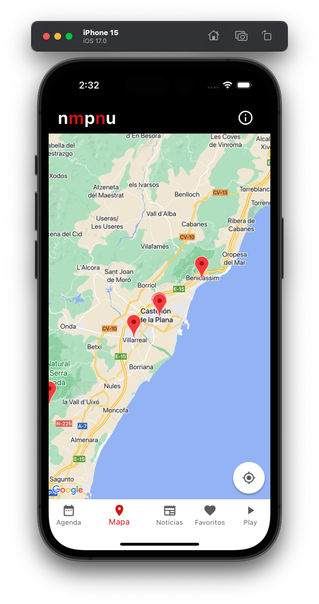
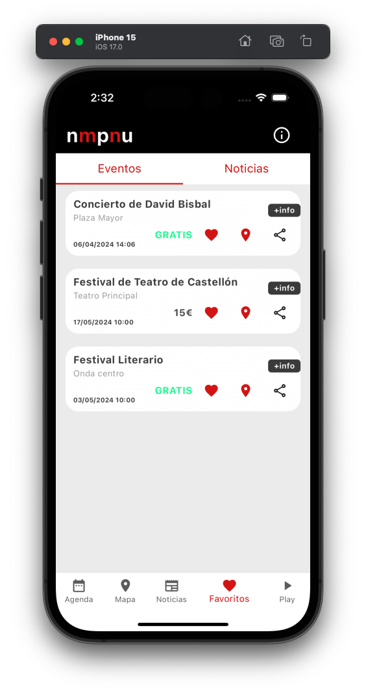

# Flutter Learning Project

## Description

This Flutter project is my first deep dive into mobile application development, inspired by the mobile version of [No Me Pierdo Ni Una](https://www.nomepierdoniuna.net/). Designed as a hands-on learning project, it showcases the integration of various technologies and architectural patterns to build a robust and scalable application. 

Key features and technologies include:

- **Supabase for Data Management**: Utilizes Supabase for real-time data handling, providing a seamless backend service for storing and retrieving application data.
- **Firebase for Notifications**: Integrates Firebase to enable the reliable delivery of push notifications, enhancing user engagement and retention.
- **Bloc for State Management**: Implements the Bloc pattern for efficient state management, facilitating predictable state management and simplifying the handling of user interactions.
- **Get_it + Injectable for Dependency Injection**: Takes advantage of Get_it and Injectable for dependency injection, promoting a modular and decoupled architecture.
- **Clean Architecture**: Follows Clean Architecture principles to structure the app, ensuring scalability, maintainability, and ease of testing, illustrated by `clean.png`.

## Screenshots

Here are some snapshots of the application in action, showcasing its layout, features, and responsiveness across different screens.

  
   
  
  
  
  
  
  
  
  
  

## Features

- **Responsive Design**: Features a user interface that adapts seamlessly across mobile devices of various sizes.
- **Internationalization Support**: Comes ready with a setup for multi-language support.
- **Predefined Development and Deployment Scripts**: Simplifies the development workflow and deployment process with predefined scripts.

## Clean Architecture

The application adheres to the principles of Clean Architecture, ensuring that the codebase is scalable, maintainable, and easily testable. Here's an overview of the architecture used:

